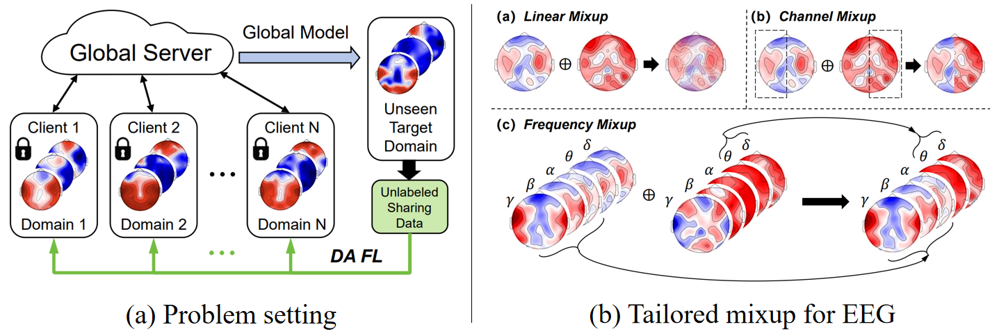

# mixEEG (CogSci 25) [](https://arxiv.org/abs/2504.07987)
🔥 Our paper [mixEEG: Enhancing EEG Federated Learning for Cross-subject EEG Classification with Tailored mixup](https://arxiv.org/abs/2504.07987) has officially been accepted as CogSci 25 for Oral presentation.

📝 For the first time, we investigate the cross-subject EEG classification in the FL setting, including the DG FL and DA FL settings.

🛠️ In this paper, we propose a simple yet effective framework termed **mixEEG**. Specifically, we tailor the vanilla _mixup_ considering the unique properties of the EEG modality.
mixEEG shares the unlabeled averaged data of the unseen subject rather than simply sharing raw data under the domain adaptation setting, thus better preserving privacy and offering an averaged label as a pseudo-label.



## How to run our code?

At first, you should creat two dirs called 'logs' and 'checkpoints', then you can cd into 'src', and run mixEEG:

Here is an explanation of some parameters,
1. `--model`: model architecture to be used, (e.g., `mlp` or `cnn`).
2. `--dataset`: name of the datasets, (e.g., `seed` or `chbmit`).
4. `--frac`: fraction of clients to be ramdonly sampled at each round, (e.g., `0.2` or `1.0`).
5. `--iid`: IID or non-IID partition strategy, in our paper is always 1.
6. `--epochs`: the number of total communication rounds. (default: `100`)
7. `--lr`: the initial learning rate for local training (default: `0.01`)
8. `--mixup_strategy`: the strategy for mixup, `none` for the vanilla FedAvg, `lin` for linear mixup, `cha` for channel mixup, and `fre` for frequency mixup.
9. `--mixup_alpha`: useful only under the linear mixup mode. (e.g., `0.2` or `1.0`).
10. `--mixup_subtype`: the subtype of each mixup strategy, the meanings are the same as the paper. (e.g., `random`, `cross`, `cut` or `binary`).
11. `--gpu`: the GPU id to be used, it depends on your machine. (default: `0`)

**the DG FL settings:**
```shell
python3 federated_eeg_LOSO.py --model=mlp --dataset=seed --target_id=15 --num_users=14 --frac=0.2 --iid=1 --epochs=100 --lr=0.01 --local_ep=5 --local_bs=32 --mixup_strategy="lin" --mixup_alpha=1.0 --mixup_subtype="none"
python3 federated_eeg_LOSO.py --model=mlp --dataset=seed --target_id=15 --num_users=14 --frac=0.2 --iid=1 --epochs=100 --lr=0.01 --local_ep=5 --local_bs=32 --mixup_strategy="lin" --mixup_alpha=0.2 --mixup_subtype="none" --gpu=1
python3 federated_eeg_LOSO.py --model=mlp --dataset=seed --target_id=15 --num_users=14 --frac=0.2 --iid=1 --epochs=100 --lr=0.01 --local_ep=5 --local_bs=32 --mixup_strategy="cha" --mixup_alpha=0.2 --mixup_subtype="random" --gpu=1
python3 federated_eeg_LOSO.py --model=mlp --dataset=seed --target_id=15 --num_users=14 --frac=0.2 --iid=1 --epochs=100 --lr=0.01 --local_ep=5 --local_bs=32 --mixup_strategy="cha" --mixup_alpha=0.2 --mixup_subtype="binary" --gpu=2
python3 federated_eeg_LOSO.py --model=mlp --dataset=seed --target_id=15 --num_users=14 --frac=0.2 --iid=1 --epochs=100 --lr=0.01 --local_ep=5 --local_bs=32 --mixup_strategy="fre" --mixup_alpha=0.2 --mixup_subtype="cut" --gpu=0
python3 federated_eeg_LOSO.py --model=mlp --dataset=seed --target_id=15 --num_users=14 --frac=0.2 --iid=1 --epochs=100 --lr=0.01 --local_ep=5 --local_bs=32 --mixup_strategy="fre" --mixup_alpha=0.2 --mixup_subtype="cross" --gpu=0
python3 federated_eeg_LOSO.py --model=mlp --dataset=seed --target_id=15 --num_users=14 --frac=0.2 --iid=1 --epochs=100 --lr=0.01 --local_ep=5 --local_bs=32 --mixup_strategy="none" --mixup_alpha=0.2 --mixup_subtype="cross" --gpu=0
python3 federated_eeg_LOSO.py --model=cnn --dataset=chbmit --target_id=10 --num_users=9 --frac=0.3 --iid=1 --epochs=100 --lr=0.01 --local_ep=5 --local_bs=32 --mixup_strategy="none" --mixup_alpha=0.2 --mixup_subtype="cross" --gpu=1
python3 federated_eeg_LOSO.py --model=cnn --dataset=chbmit --target_id=10 --num_users=9 --frac=0.3 --iid=1 --epochs=100 --lr=0.01 --local_ep=5 --local_bs=32 --mixup_strategy="lin" --mixup_alpha=0.2 --mixup_subtype="cross" --gpu=1
python3 federated_eeg_LOSO.py --model=cnn --dataset=chbmit --target_id=10 --num_users=9 --frac=0.3 --iid=1 --epochs=100 --lr=0.01 --local_ep=5 --local_bs=32 --mixup_strategy="lin" --mixup_alpha=5.0 --mixup_subtype="cross" --gpu=1
python3 federated_eeg_LOSO.py --model=cnn --dataset=chbmit --target_id=10 --num_users=9 --frac=0.3 --iid=1 --epochs=100 --lr=0.01 --local_ep=5 --local_bs=32 --mixup_strategy="cha" --mixup_alpha=0.2 --mixup_subtype="random" --gpu=1
python3 federated_eeg_LOSO.py --model=cnn --dataset=chbmit --target_id=10 --num_users=9 --frac=0.3 --iid=1 --epochs=100 --lr=0.01 --local_ep=5 --local_bs=32 --mixup_strategy="cha" --mixup_alpha=0.2 --mixup_subtype="binary" --gpu=1
python3 federated_eeg_LOSO.py --model=cnn --dataset=chbmit --target_id=10 --num_users=9 --frac=0.3 --iid=1 --epochs=100 --lr=0.01 --local_ep=5 --local_bs=32 --mixup_strategy="fre" --mixup_alpha=0.2 --mixup_subtype="cut" --gpu=2
python3 federated_eeg_LOSO.py --model=cnn --dataset=chbmit --target_id=10 --num_users=9 --frac=0.3 --iid=1 --epochs=100 --lr=0.01 --local_ep=5 --local_bs=32 --mixup_strategy="fre" --mixup_alpha=0.2 --mixup_subtype="cross" --gpu=2
```

**the DA FL settings:** only need to replace federated_eeg_LOSO.py to federated_eeg_LOSO_DA.py
```shell
python3 federated_eeg_LOSO_DA.py --model=mlp --dataset=chbmit --target_id=10 --num_users=9 --frac=0.3 --iid=1 --epochs=10 --lr=0.01 --local_ep=5 --local_bs=32 --mixup_strategy="none" --mixup_alpha=0.2 --mixup_subtype="cross" --gpu=1
python3 federated_eeg_LOSO_DA.py --model=cnn --dataset=seed --target_id=10 --num_users=9 --frac=0.3 --iid=1 --epochs=10 --lr=0.01 --local_ep=5 --local_bs=32 --mixup_strategy="none" --mixup_alpha=0.2 --mixup_subtype="cross" --gpu=1
```

## BibTeX
If you find our paper / code helpful, please consider citing our work:
```
@inproceedings{liu2025mixeeg,
  title={mix{EEG}: Enhancing {EEG} Federated Learning for Cross-subject {EEG} Classification with Tailored mixup},
  author={Liu, Xuan-Hao and Lu, Bao-Liang and Zheng, Wei-Long},
  booktitle={Proceedings of the Annual Meeting of the Cognitive Science Society},
  year={2025}
}
```

## Acknowledgement
This code is built based on this [FedAvg Code Repo](https://github.com/zj-jayzhang/FedAvg).
